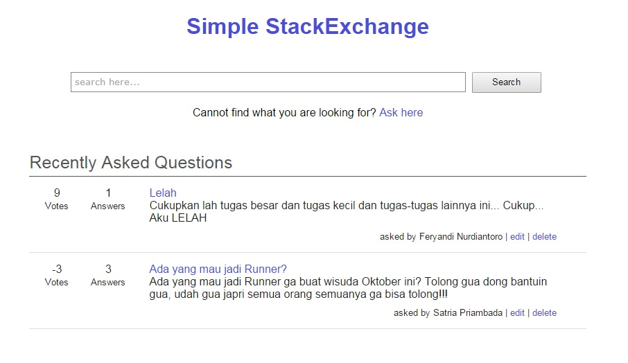

# Simple StackExchange Website

## How to use / open this:
1. Clone this repository and put it on your localhost (not tested if the host is not localhost)
2. Import the SQL Dump (wbd_stackoverflow.sql) to your DBMS
3. Change the config.php.default to your database settings, and change the file name to config.php
4. Go to your localhost and you should see this

## Penjelasan Teknis 
**Melakukan validasi pada client-side**
Validasi dilakukan menggunakan Javascript dengan membuat function yang dipanggil pada html menggunakan onSubmit pada bagian form.
Validasi pertama-tama melakukan pengecekan isi dari kotak input, jika kosong maka validasi akan dihentikan dan mengembalikan false sehingga
submit tidak dilaksanakan. Jika validasi input kosong telah lolos, maka akan dilakukan validasi email menggunakan regex, dimana hanya dicek
apakah masukkan berupa xxxx@xxxx.xxx (tidak digunakan regex yang rumit)

**Melakukan AJAX (mulai dari pengguna melakukan klik pada tombol vote sampai angka vote berubah)**
Ketika tombol vote di klik, akan di trigger fungsi dari javascript yakni voting dengan parameter id, type, dan q_a. 
Dimana id adalah id dari answer atau question, type adalah jenis vote yakni up atau down, serta q_a adalah answer atau question.
Didalam fungsi dilakukan fungsi AJAX yang memanggil file php yakni vote.php yang menerima perintah GET yang parameternya sama dengan fungsi vote.
Dalam file php ini dilakukan manipulasi database (UPDATE), serta mengeluarkan nilai vote setelah diupdate.
AJAX yang masih menunggu, akan menerima hasil keluaran (echo) dari vote.php tersebut dan akan menampilkannya melalui getElementByID.

## About
Author: feryandi

Code: Basic PHP (without framework), JS and CSS (without libraries)