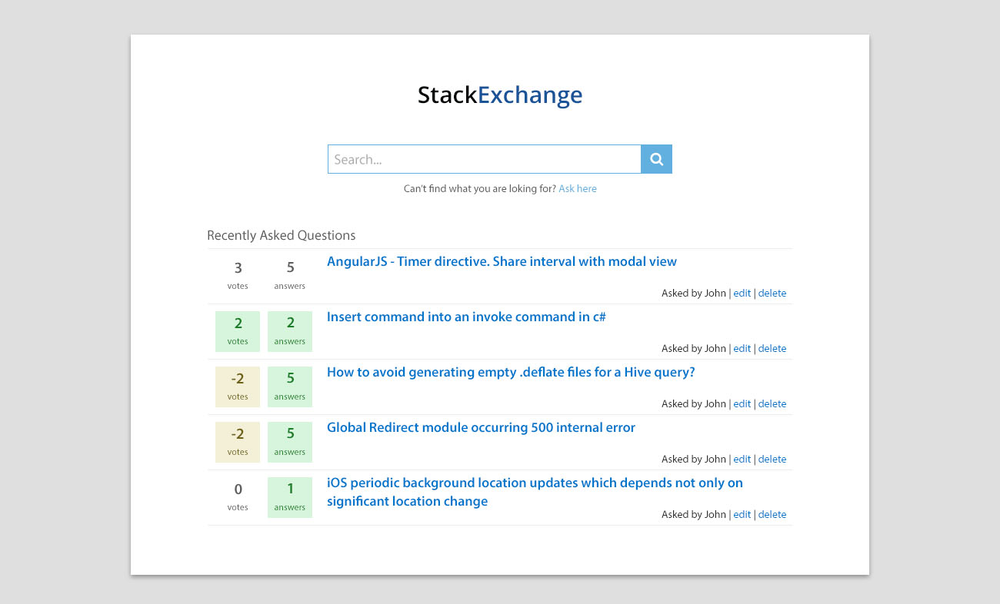
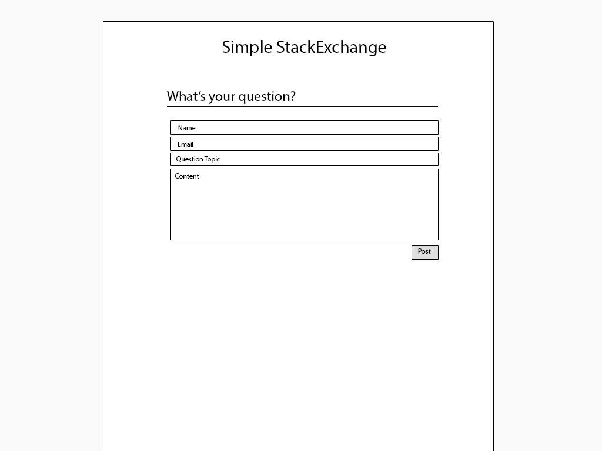
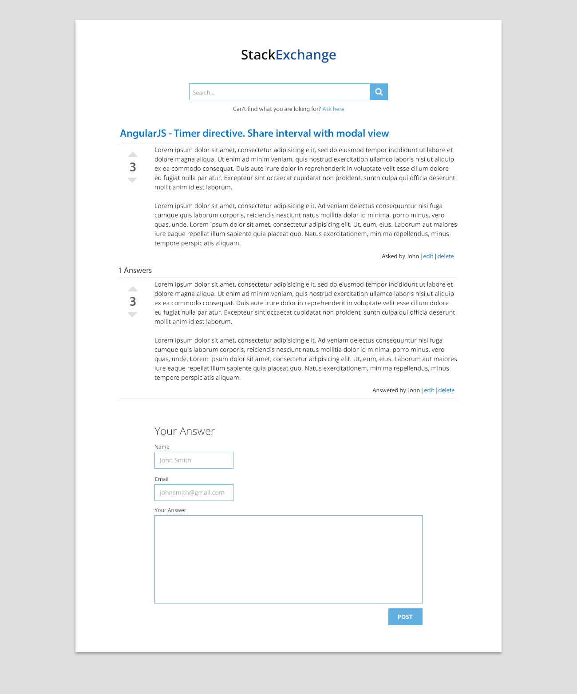

# Tugas 1 IF3110 Pengembangan Aplikasi Berbasis Web

Membuat Website tanya jawab seperti Stack Exchange.

**Luangkan waktu untuk membaca spek ini sampai selesai. Kerjakan hal yang perlu saja.**

## Anggota Tim

Tugas dikerjakan secara individu.

## Petunjuk Pengerjaan

1. Fork pada repository ini dengan akun github anda.
2. Silakan commit pada repository anda (hasil fork). Lakukan berberapa commit dengan pesan yang bermakna, contoh: `fix css`, `create post done`, jangan seperti `final`, `benerin dikit`. Disarankan untuk tidak melakukan commit dengan perubahan yang besar karena akan mempengaruhi penilaian (contoh: hanya melakukan satu commit kemudian dikumpulkan). 
3. Ubah **Penjelasan Teknis** pada bagian bawah readme.md ini dengan menjelaskan bagaimana cara anda:
   - Melakukan validasi pada client-side
   - Melakukan AJAX (mulai dari pengguna melakukan klik pada tombol vote sampai angka vote berubah).
4. Pull request dari repository anda ke repository ini dengan format **NIM** - **Nama Lengkap** sebelum **Jumat, 16 Oktober 2015 23.59**.

## Tools

1. Untuk backend, wajib menggunakan **PHP** tanpa framework apapun.
2. Gunakan **MySQL** atau basis data relasional lain untuk menyimpan data.
3. Untuk frontend, gunakan Javascript, HTML dan CSS. **Tidak boleh** menggunakan library atau framework CSS atau JS seperti JQuery atau Bootstrap. CSS sebisa mungkin ada di file yang berbeda dengan PHP (tidak inline styling).

## Spesifikasi

### Tampilan

Anda diminta untuk membuat tampilan sedemikian hingga mirip dengan tampilan berikut. Website yang diminta tidak harus responsive. Desain tampilan tidak perlu dibuat indah. Icon dan jenis font tidak harus sama dengan contoh. Warna font, garis pemisah, dan perbedaan ukuran font harus terlihat sesuai contoh. Perhatikan juga **tata letak** elemen-elemen.

- Search bar diletakkan di bagian paling atas setelah judul.
- Tombol "search" berada di sebelah kanan search bar.
- **Ask here** digunakan untuk mengajukan pertanyaan baru.
- Tampilan search bar ini harus tetap ada walaupun anda tidak mengimplementasikan fitur search.
- Tampilan pertanyaan tidak harus urut berdasarkan "recently asked question", namun tulisan recently ini harus ada.
- Pada bagian item pertanyaan, terdapat judul pertanyaan (question topic). Tambahkan juga isi pertanyaan sesuai spesifikasi "list pertanyaan" (walaupun digambar tidak ada).

- Tampilan di atas digunakan untuk mengajukan atau mengubah pertanyaan.
- Perhatikan label dari field pada form berada di dalam field (tidak di luar)

- Bagian ini menampilkan pertanyaan. Bentuk icon vote up/down tidak perlu sama. Bagian `datetime` tidak harus ada. Bagian `username` dapat anda isi dengan email.
- Perhatikan label dari field pada form berada di dalam field (tidak di luar)

### List pertanyaan

Halaman utama berisi daftar judul pertanyaan, siapa yang bertanya, dan isi pertanyaan. Isi pertanyaan yang terlalu panjang harus dipotong. Silakan definisikan sendiri seberapa panjang agar tetap baik terlihat di layout yang Anda buat.

Pada masing-masing elemen list, terdapat menu untuk mengubah dan menghapus pertanyaan.

### Bertanya

Pengguna dapat mengajukan pertanyaan. Form yang digunakan memiliki judul, email, nama, dan isi pertanyaan. Gunakan HTTP POST.

### Ubah Pertanyaan

Pengguna dapat mengubah pertanyaan yang sudah dibuat. Form yang digunakan memiliki tampilan yang sama dengan form untuk bertanya, namun field-field yang ada sudah terisi. Gunakan HTTP POST.

### Hapus Pertanyaan

Pengguna dapat menghapus pertanyaan yang sudah dibuat. Lakukan konfirmasi penghapusan dengan javascript.

### Lihat Pertanyaan

Pengguna dapat melihat pertanyaan dan semua jawabannya. Pada halaman ini terdapat informasi judul, isi pertanyaan, email, dan nama. Untuk jawaban, tampilkan email, nama, konten jawaban, dan jumlah vote pada jawaban tersebut.

### Menjawab pertanyaan

Jawaban pertanyaan berisi email, nama, dan konten jawabannya. Gunakan HTTP POST untuk menjawab pertanyaan.

### Vote (vote up, vote down)

Pengguna dapat melakukan vote up atau vote down ke suatu pertanyaan. Ketika pengguna menekan tombol vote, halaman tidak boleh refresh tapi jumlah vote akan berubah dan tersimpan ke basis data. Jumlah vote yang akan berubah sesuai dengan banyaknya vote yang ada di basis data (jadi tidak asal nambah satu saja). 

### Validasi

Validasi **wajib** dilakukan pada *client-side*, dengan menggunakan **javascript** bukan HTML 5 input type, yaitu:
- Setiap field pada form tidak boleh kosong.
- Email harus sesuai format email.

### Bonus

Pengguna dapat mencari pertanyaan dengan melakukan search ke `judul` maupun `isi pertanyaan`.

### Penjelasan Teknis

----------

#### Melakukan Validasi pada Client-Side
Validasi form pada client side, dilakukan dengan menggunakan javascript. Setiap kali user menekan tombol `POST`, kita ambil value untuk setiap field ,contohnya mengambil field nama dengan :
`var name = document.getElementById('name');`.

Semua field tersebut dipassing sebagai argumen ke sebuah fungsi yang melakukan validasi. Iterasi untuk semua field , lakukan :

 1. **Pengecekan apakah setiap field sudah terisi**.
Menggunakan `if(arguments[i].value.trim()==='')`
Jika bernilai true, maka field kosong, tidak valid dan return false. Jika semua field valid untuk pengecekan pertama, lanjut ke pengecekan kedua.

 2. **Cek apakah format email valid**. 
Pertama - tama cek apakah field yang sedang di periksa adalah field untuk email, hal ini bisa dilakukan dengan mencek id/name/class dari field tersebut : `if(arguments[i].id==="email")`. 
Jika field tersebut adalah  email, kita lakukan validasi, dengan membandingkan apakah value dari email yang diisi sesuai dengan regular expression untuk sebuah email yang valid.

    `var re = /^([\w-]+(?:\.[\w-]+)*)@((?:[\w-]+\.)*\w[\w-]{0,66})\.([a-z]{2,6}(?:\.[a-z]{2})?)$/i;
    return re.test(email);`

Regular expression diatas bisa dimodifikasi sesuai dengan kompleksitas yang diinginkan.

Validasi diatas dilakukan sampai form valid. Jika belum valid, diberikan peringatan kepada user, dalam hal ini ditambahkan error styling pada  setiap field yang belum valid (Border input berwarna merah).

----------

#### Melakukan AJAX untuk Vote

Pada saat user menekan tombol vote, kita ambil id dari pertanyaan/jawaban yang sedang di vote. Kemudian dilakukan langkah - langkah sebagai berikut :

 1. **AJAX request**
    - Membuat objek httprequest : `var http = new XMLHttpRequest();`
    - Set URL untuk request, contohnya untuk vote pertanyaan  : `var url = "doVoteQuestion.php";`
    - Tambahkan parameter, dalam hal ini, nilai ID dari pertanyaan yang akan di vote dan operasi nya ( voteUp/voteDown ). Contoh :
    ` var params = "qID=" + qID + "&operation=plus";`
    - Membuat koneksi dan menset request header
 `http.open("POST", url, true);`    
`http.setRequestHeader("Content-type","application/x-www-form-urlencoded");`
    `http.setRequestHeader("Content-length", params.length);`
     `http.setRequestHeader("Connection", "close");`
    - Mengirim parameter : `http.send(params);`
 
 2. AJAX request diatas **diterima oleh sisi server**, dalam hal ini `doVoteQuestion.php`. Dilakukan :
    - Menerima parameter postnya dengan `$_POST`, yakni untuk `qID` dan `operation`.
    - Berdasarkan operatornya dilakukan update nilai vote ( yang nilai `q_ID = qID` ) dari tabel `questions` yang ada pada database. Vote ditambah/dikurangi 1 berdasarkan `operation` yang dipost.
    - Vote yang telah diupdate kemudian di `SELECT` dari tabel `questions` pada database sesuai dengan `qID`nya.
    - Melakukan `echo/print` dari hasi select diatas, sebagai response text yang akan diterima oleh client side
 3. Pada sisi client, setelah mengirim request pada no 1, menunggu dan **menerima response** dari server pada no 2.
    `http.onreadystatechange = function () {
                if (http.readyState == 4 && http.status == 200) {
                    document.getElementsByClassName("qVoteVal")[0].innerHTML = http.responseText;
                }
            }`
    

Di dalam `if` diatas, dilakukan update pada elemen HTML yang menunjukkan jumlah vote dari pertanyaan yang bersangkutan, dimana nilainya menjadi = `http.responseText` atau hasil response dari server (`doVoteQuestion.php`).

### Knowledge

Untuk meringankan beban tugas ini, ada berberapa keyword yang bisa anda cari untuk menyelesaikan tugas ini.
- CSS: margin, padding, header tag, font-size, text-align, float, clear, border, color, div, span, placeholder, anchor tag.
- Javascript : XMLHTTPRequest.
- PHP: mysqli_connect, mysql_query, $_GET, $_POST, var_dump, print_r, echo, require, fungsi header.
- SQL query: SELECT, INSERT, UPDATE, DELETE, WHERE, operator LIKE.

Jika ada pertanyaan silakan tanyakan lewat milis.

### About

Asisten IF 3110 2015

Fahziar | Gilang | Lingga | Reza | Sudib | Tito | Willy K2 | Yafi

Dosen : Yudistira Dwi Wardhana | Riza Satria Perdana
