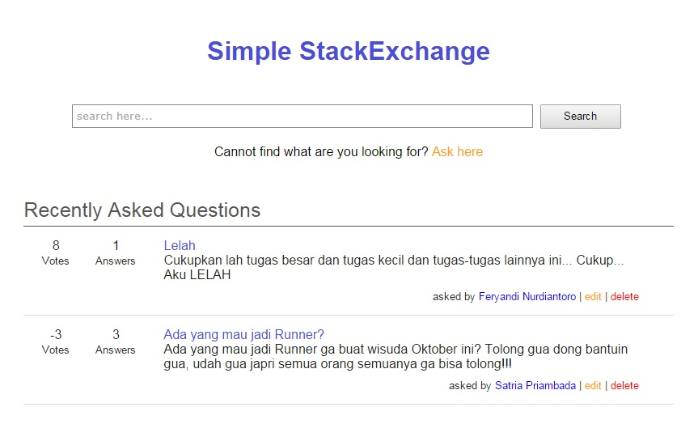

# Simple StackExchange Website
# [IF3310] Web-based Development Assignment

## How to use / open this:
1. Clone this repository and put it on your localhost (not tested if the host is not localhost)
2. Import the SQL Dump (wbd_stackoverflow.sql) to your DBMS
3. Change the config.php.default to your database settings, and change the file name to config.php
4. Go to your localhost and you should see this

## About
Author: feryandi
Code: Basic PHP (without framework), JS and CSS (without libraries)